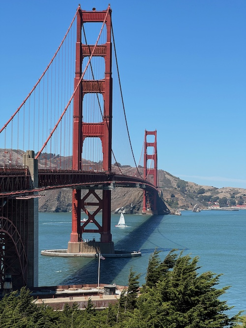
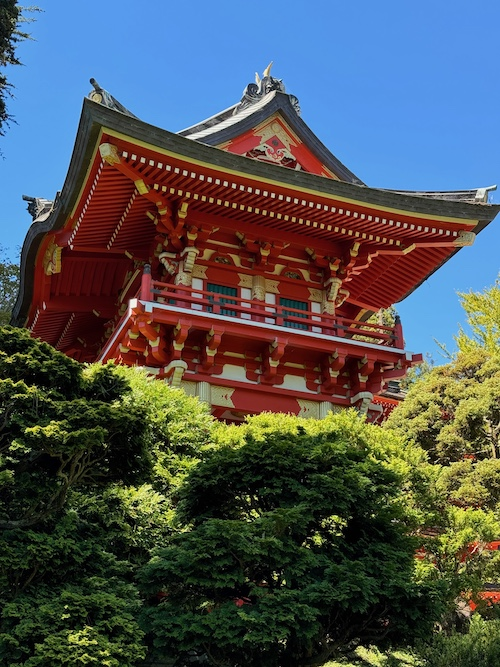
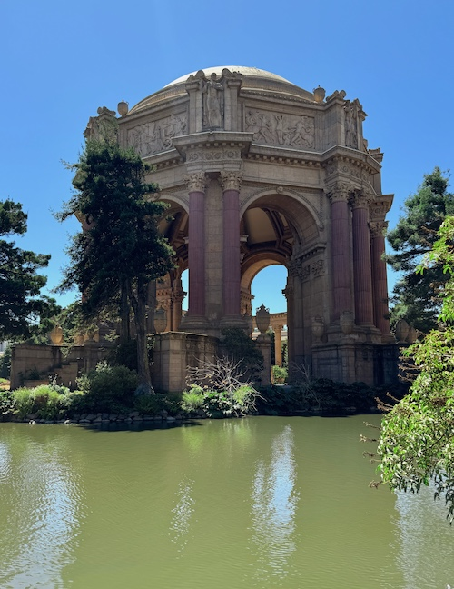

<!DOCTYPE html>
<html lang="en">
<head>
    <meta charset="UTF-8">
    <meta name="viewport" content="width=device-width, initial-scale=1.0">

    <title>SF Pictures</title>
  

</head>

<body>

    <h1><strong>Pictures of San Francisco Landmarks</strong></h1>

    
A collection of pictures I took on a recent trip to San Francisco

  

  

    
  

  <b>Golden Gate Bridge</b>
  
<i>Taken with iPhone 15</i>

  

  

    
  

  <b>A Pagoda at the Japanese Tea Garden</b>
   
<i>Taken with iPhone 15</i>

  

  

    
  

  <b>The Palace of Fine Arts</b>
  
<i>Taken with iPhone 15</i>

 

  <article><h2> Francisco is a great walking city but it is a bit of a chalange walking west to east since that takes you through the hills.
      It's famously referred to as 7x7 because the city is 7 miles wide by 7 miles tall.</h2> </article>
    <h2> notable locations to visit.</h2>

    <ul>
      <li><a href="https://www.fishermanswharf.org/"><h3>Fisherman's Wharf</h3></a></li>
      <li><a href="https://www.ferrybuildingmarketplace.com/"><h3>Ferry Building</h3></a></li>
      <li><a href="https://sfrecpark.org/770/Golden-Gate-Park"><h3>Golden Gate Park</h3></a></li>
    </ul>
 

<button id="scrollToTopBtn">Go to Top</button>

</body>
</html># rustybaja.github.io
